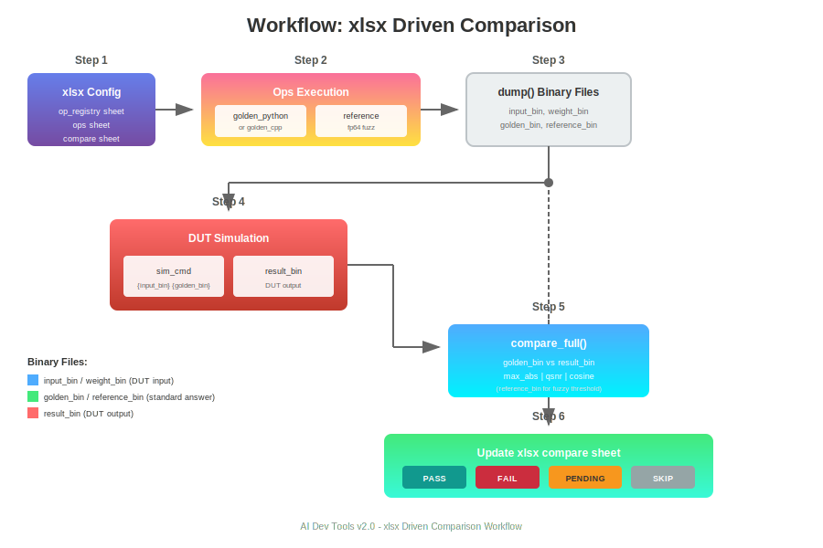

# AI Dev Tools 架构设计

## 1. 概述

AI Dev Tools 是一套用于自研芯片算子验证的工具集，提供从 Golden 生成、数据量化、到精度比对的完整工作流。

### 1.1 核心能力

- **Golden 生成**：支持 Python/C++ 双模式算子实现
- **量化格式**：BFP (Block Floating Point)、GFloat 等自定义格式
- **精度模式**：pure (纯 fp32) / quant (量化感知) 双轨验证
- **四状态判定**：PASS / GOLDEN_SUSPECT / DUT_ISSUE / BOTH_SUSPECT
- **Golden 自检**：自动检测 Golden 数据有效性

## 2. 架构总览


### 2.1 分层架构

```
┌─────────────────────────────────────────────────────────────────────────────┐
│                              应用层 (Application)                            │
│  ┌──────────────┐  ┌──────────────┐  ┌──────────────┐  ┌──────────────┐    │
│  │  demos/      │  │  xlsx 工作流  │  │  Python API  │  │    CLI       │    │
│  │  示例脚本    │  │  表格驱动     │  │  编程接口    │  │  命令行      │    │
│  └──────────────┘  └──────────────┘  └──────────────┘  └──────────────┘    │
└─────────────────────────────────────┬───────────────────────────────────────┘
                                      │
┌─────────────────────────────────────▼───────────────────────────────────────┐
│                              前端层 (Frontend)                               │
│  ┌──────────────┐  ┌──────────────┐  ┌──────────────┐                      │
│  │    types     │  │   datagen    │  │   compile    │                      │
│  │  统一类型    │  │  数据生成    │  │  编译封装    │                      │
│  └──────────────┘  └──────────────┘  └──────────────┘                      │
└─────────────────────────────────────┬───────────────────────────────────────┘
                                      │
┌─────────────────────────────────────▼───────────────────────────────────────┐
│                              比对层 (Compare)                                │
│  ┌──────────────┐  ┌──────────────┐  ┌──────────────┐  ┌──────────────┐    │
│  │    exact     │  │    fuzzy     │  │    sanity    │  │    engine    │    │
│  │  精确比对    │  │  模糊比对    │  │  Golden自检  │  │  比对引擎    │    │
│  └──────────────┘  └──────────────┘  └──────────────┘  └──────────────┘    │
└─────────────────────────────────────┬───────────────────────────────────────┘
                                      │
┌─────────────────────────────────────▼───────────────────────────────────────┐
│                              格式层 (Formats)                                │
│  ┌──────────────┐  ┌──────────────┐  ┌──────────────┐  ┌──────────────┐    │
│  │    numpy     │  │     raw      │  │  custom/bfp  │  │custom/gfloat │    │
│  │   npy/npz    │  │   二进制     │  │  块浮点      │  │  自定义浮点  │    │
│  └──────────────┘  └──────────────┘  └──────────────┘  └──────────────┘    │
└─────────────────────────────────────────────────────────────────────────────┘
```

## 3. 核心模块详解

### 3.1 compare - 比对模块

```python
from aidevtools.compare import (
    CompareEngine,
    CompareConfig,
    CompareResult,
    CompareStatus,
)

# 配置
config = CompareConfig(
    exact_max_abs=0.0,           # 精确比对最大绝对误差
    exact_max_count=0,           # 精确比对最大不匹配数
    fuzzy_atol=1e-5,             # 模糊比对绝对容差
    fuzzy_rtol=1e-3,             # 模糊比对相对容差
    fuzzy_min_qsnr=30.0,         # 最小 QSNR (dB)
    fuzzy_min_cosine=0.999,      # 最小余弦相似度
    sanity_min_qsnr=20.0,        # Golden 自检最小 QSNR
)

# 创建引擎
engine = CompareEngine(config)

# 执行比对
result = engine.compare(
    dut_output=dut,
    golden_pure=golden_fp32,
    golden_qnt=golden_qnt,
    name="matmul_0",
)

print(f"Status: {result.status.value}")
```

### 3.2 frontend - 前端模块

```python
from aidevtools.frontend import (
    DataGenerator,
    DType,
    DistType,
    Tensor,
    Compiler,
)

# 数据生成
gen = DataGenerator(seed=42)
x = gen.gen_input(shape=(2, 64), dtype=DType.BFP16, dist=DistType.NORMAL)
w = gen.gen_weight(shape=(64, 128), dtype=DType.BFP16, init=DistType.XAVIER)

# 编译封装
compiler = Compiler()
result = compiler.compile_python(source="model.py", output="model.bin")
```

### 3.3 tensor - 统一张量

```python
@dataclass
class Tensor:
    data: np.ndarray                    # fp32 数据
    quant_data: Optional[bytes]         # 量化后数据
    meta: TensorMeta                    # 元信息

    @classmethod
    def from_numpy(cls, data, name, dtype) -> "Tensor":
        """从 numpy 创建"""

    def save(self, path):
        """保存到文件"""

    @classmethod
    def load(cls, path) -> "Tensor":
        """从文件加载"""
```

**支持的数据类型：**
| 类型 | 说明 | 存储 |
|------|------|------|
| float32 | 原始精度 | fp32 |
| float16 | 半精度 | fp16 |
| bfp16 | 块浮点 16 (8-bit mantissa) | int8 + exp |
| bfp8 | 块浮点 8 (4-bit mantissa) | int8 + exp |
| bfp4 | 块浮点 4 (2-bit mantissa) | int8 + exp |
| gfloat16 | 自定义 16 位 (1+8+7) | uint16 |
| gfloat8 | 自定义 8 位 (1+4+3) | uint8 |
| gfloat4 | 自定义 4 位 (1+2+1) | uint8 |

### 3.4 ops - 算子模块

```python
from aidevtools.ops import _functional as F

# PyTorch 风格 API
y = F.matmul(x, w)
y = F.layer_norm(y, normalized_shape=(hidden,))
y = F.softmax(y, dim=-1)
y = F.gelu(y)

# 获取记录
for r in ops.get_records():
    print(f"{r.op_name}: {r.golden.shape}")
```

**内置算子：**
- linear, matmul, relu, gelu, softmax
- layernorm, attention, add, mul, embedding
- transpose, sigmoid, tanh, silu

## 4. 四状态判定机制


### 4.1 判定矩阵

```
                    ┌─────────────┐
                    │  DUT 输出   │
                    │  (待验证)   │
                    └──────┬──────┘
                           │
           ┌───────────────┼───────────────┐
           │               │               │
           ▼               ▼               ▼
    ┌─────────────┐ ┌─────────────┐ ┌─────────────┐
    │   Exact     │ │ Fuzzy Qnt   │ │   Sanity    │
    │  精确比对   │ │ 模糊比对    │ │ Golden自检  │
    └──────┬──────┘ └──────┬──────┘ └──────┬──────┘
           │               │               │
           └───────────────┼───────────────┘
                           ▼
    ┌─────────────────────────────────────────────┐
    │              状态判定 (Status)               │
    └─────────────────────────────────────────────┘
```

### 4.2 状态判定规则

| DUT vs Golden | Golden 自检 | 判定状态 | 含义 |
|---------------|-------------|----------|------|
| PASS | PASS | **PASS** | DUT 正确，Golden 有效 |
| PASS | FAIL | **GOLDEN_SUSPECT** | DUT 匹配，但 Golden 可疑 |
| FAIL | PASS | **DUT_ISSUE** | Golden 有效，DUT 有问题 |
| FAIL | FAIL | **BOTH_SUSPECT** | 都可疑，需人工排查 |

### 4.3 Golden 自检项

- **non_zero**: 数据非全零
- **no_nan_inf**: 无 NaN/Inf
- **range_valid**: 数值范围合理
- **qsnr_valid**: golden_qnt vs golden_pure QSNR >= 阈值

### 4.4 比对结果示例

```
==============================================================================================================
name            exact  f_pure   f_qnt   sanity     max_abs     qsnr   cosine        status
--------------------------------------------------------------------------------------------------------------
matmul_0           Y       Y       Y       Y     0.00e+00      inf 1.000000          PASS
layernorm_0        N       Y       Y       Y     2.52e-01    17.54 0.991358          PASS
softmax_0          N       Y       N       N     2.63e-02    14.54 0.982997   BOTH_SUSPECT
conv_0             N       N       N       Y     1.00e+00      8.8 0.993808      DUT_ISSUE
==============================================================================================================
Summary: 2 PASS, 0 GOLDEN_SUSPECT, 1 DUT_ISSUE, 1 BOTH_SUSPECT (total: 4)
```

## 5. 数据流



### 5.1 Golden 生成流程

```
┌─────────────┐     ┌─────────────┐     ┌─────────────┐
│  生成输入   │ ──▶ │  执行算子   │ ──▶ │  记录结果   │
│ (Tensor)    │     │ (F API)     │     │ (OpRecord)  │
└─────────────┘     └─────────────┘     └─────────────┘
      │                   │                   │
      │                   │                   │
      ▼                   ▼                   ▼
┌─────────────┐     ┌─────────────┐     ┌─────────────┐
│   fp32 +    │     │ golden_pure │     │   inputs    │
│  quantized  │     │ golden_quant│     │   weights   │
└─────────────┘     └─────────────┘     │   output    │
                                        └─────────────┘
```

### 5.2 比对验证流程

```
┌─────────────┐     ┌─────────────┐     ┌─────────────┐
│   加载      │ ──▶ │  比对引擎   │ ──▶ │  生成报告   │
│ Golden+DUT  │     │CompareEngine│     │ report.py   │
└─────────────┘     └─────────────┘     └─────────────┘
                          │
          ┌───────────────┼───────────────┐
          ▼               ▼               ▼
    ┌───────────┐   ┌───────────┐   ┌───────────┐
    │   exact   │   │   fuzzy   │   │  sanity   │
    │   result  │   │   result  │   │   result  │
    └───────────┘   └───────────┘   └───────────┘
```

## 6. 目录结构

```
aidevtools/
├── aidevtools/
│   ├── core/                    # 核心模块
│   │   ├── __init__.py          # 统一导出
│   │   ├── config.py            # 全局配置
│   │   └── log.py               # 日志
│   │
│   ├── compare/                 # 比对模块 (新)
│   │   ├── __init__.py          # 统一导出
│   │   ├── types.py             # 类型定义
│   │   ├── metrics.py           # 指标计算
│   │   ├── exact.py             # 精确比对
│   │   ├── fuzzy.py             # 模糊比对
│   │   ├── sanity.py            # Golden 自检
│   │   ├── engine.py            # 比对引擎
│   │   └── report.py            # 报告生成
│   │
│   ├── frontend/                # 前端模块 (新)
│   │   ├── __init__.py          # 统一导出
│   │   ├── types.py             # 统一类型
│   │   ├── datagen.py           # 数据生成
│   │   └── compile.py           # 编译封装
│   │
│   ├── formats/                 # 数据格式
│   │   ├── base.py              # 格式基类
│   │   ├── numpy.py             # npy/npz
│   │   ├── raw.py               # 二进制
│   │   ├── quantize.py          # 量化注册表
│   │   └── custom/              # 自定义格式
│   │       ├── bfp/             # 块浮点
│   │       └── gfloat/          # 自定义浮点
│   │
│   ├── ops/                     # 算子模块
│   │   ├── __init__.py
│   │   ├── _functional.py       # F API
│   │   ├── base.py              # 基础函数
│   │   └── cpu_golden.py        # CPU Golden
│   │
│   ├── golden/                  # Golden 实现
│   │   ├── cpu_golden           # C++ CLI
│   │   └── cpp/                 # C++ 源码
│   │
│   ├── tools/                   # 工具集
│   │   └── compare/             # 比对工具 (旧)
│   │
│   ├── trace/                   # 插桩工具
│   │   └── tracer.py
│   │
│   └── xlsx/                    # Excel 工作流
│       ├── export.py
│       ├── import_.py
│       └── run.py
│
├── demos/                       # 示例
│   ├── 01_basic_ops/
│   ├── 02_mini_transformer/
│   ├── 03_transformer/
│   ├── 04_xlsx_basic/
│   ├── 05_xlsx_transformer/
│   ├── 07_transpose/
│   └── 08_paper_analysis/
│
├── tests/                       # 测试
│   └── ut/                      # 单元测试
│
└── docs/                        # 文档
    ├── architecture.md          # 架构设计
    └── compare_guide.md         # 比对指南
```

## 7. 使用示例

### 7.1 PyTorch 风格 API

```python
import numpy as np
from aidevtools import ops
from aidevtools.ops import _functional as F

# 清空记录
ops.clear()

# 使用 F API 执行算子
x = np.random.randn(2, 8, 64).astype(np.float32)
w = np.random.randn(64, 128).astype(np.float32)

y = F.matmul(x, w)
y = F.layer_norm(y, (128,))
y = F.softmax(y, dim=-1)

# 获取 Golden 记录
for r in ops.get_records():
    print(f"{r.op_name}: input={r.input.shape}, golden={r.golden.shape}")
```

### 7.2 比对 API

```python
from aidevtools.compare import CompareEngine, CompareConfig

# 创建比对引擎
config = CompareConfig(
    fuzzy_min_qsnr=30.0,
    fuzzy_min_cosine=0.999,
)
engine = CompareEngine(config)

# 执行比对
result = engine.compare(
    dut_output=dut,
    golden_pure=golden_fp32,
    golden_qnt=golden_qnt,
    name="matmul_0",
)
print(f"Status: {result.status.value}")
```

### 7.3 数据生成 API

```python
from aidevtools.frontend import DataGenerator, DType

gen = DataGenerator(seed=42)

# 生成输入数据
x = gen.gen_input(shape=(2, 64), dtype="bfp16", dist="normal")

# 生成权重数据
w = gen.gen_weight(shape=(64, 128), dtype="bfp16", init="xavier")
```

### 7.4 Excel 工作流

```bash
# 生成模板
python -c "from aidevtools.xlsx import create_template; create_template('model.xlsx')"

# 编辑 model.xlsx，定义算子序列

# 执行并比对
python -c "from aidevtools.xlsx import run_xlsx; run_xlsx('model.xlsx', 'results/')"
```

## 8. 扩展指南

### 8.1 添加新算子

```python
from aidevtools.ops.base import register_op

@register_op("my_op")
def my_op_impl(x, w, **kwargs):
    """自定义算子实现"""
    return (x + 1) @ w
```

### 8.2 添加新量化格式

```python
from aidevtools.formats.quantize import register_quantize, register_dequantize

@register_quantize("my_format")
def to_my_format(data: np.ndarray, **kwargs):
    # 量化逻辑
    return quantized_data, meta

@register_dequantize("my_format")
def from_my_format(data: np.ndarray, meta: dict):
    # 反量化逻辑
    return fp32_data
```

## 9. 版本历史

| 版本 | 日期 | 变更 |
|------|------|------|
| v3.0 | 2025-02 | 四状态判定模型，compare/frontend 模块，目录扁平化 |
| v2.0 | 2025-01 | 统一工作流架构，三列比对 |
| v1.0 | 2024-01 | 初始版本，trace + compare |
